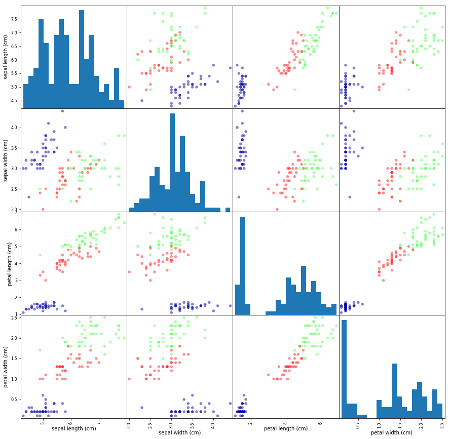

# 機械学習を一緒に勉強しませんか？

この記事は、自分が機械学習の勉強をはじめ、ノートとして扱うために作成したものです。

## はじめに、

> 余計な話なのでスキップしてもOK！

中々、分からない世界に入ってきたかもしれません。私はFront-End Developerとして約3年くらい働きました。
しかし、残念ながらJavaScriptの世界は魅力的でAngularやReactなどの世界はとても楽しい世界です。
私がこの文書を作成しているこの時点では２回目の転職が決まっている状態です。現職はSES会社のエンジニアとして、
現場ではスクラム開発チームメンバーとしてとても楽しい時間です。でもそこでたち止まりたくない。
英語もペラペラになりたい、もっと魅力的な仕事がしたいとわがままを転職市場に身を投げながら考えてました。
また、雑談ですがSESの会社としてはとても素晴らしい会社です。でも自分の夢はSESにはありませんでした。
転職してちょうど1年で会社をやめることになりました。

## 背景

本当に頭がおかしくなれるほど機械学習、AI、ディープラーニング、強化学習、・・・とこからとこまでが範囲なのか、
そもそもこれくらい開発されていたらとこかでFrameworkを発表してくれないかと思うほど、また、G検定や、E検定など（自分はG検定を勉強中です）AI世界（AIに関連する様々な技術の世界）は深くて、難しくて、「WHAT?!」、「WHAT?!」しか頭に出てきません。
AIとか、機械学習とか使うと美味しいの？楽しいの？と疑問をまたPython?なんだ〜などとこから、とこまでにすればいいのか
勉強すればするほど分からなくなってきました。それで、決めたのはG検定を受けてみる、そのあとE検定もやってみると思い、
資料を集め、AI白書をてかくて重くて持ち歩けない、電車では読めない（Kindle版に買いましょう）

[直感 Deep Learning](https://www.oreilly.co.jp/books/9784873118260/)では人工知能、機械学習、ディープラーニングを以下のように定義しています。

[参考文書:Pythonではじめる機械学習（Andreas C. Muller著）](https://www.oreilly.co.jp/books/images/picture_large978-4-87311-798-0.jpeg)

### 人工知能（artificial inteligence: AI）
> 人工知能はとても大きな研究分野で、そこでは学習による認識能力の獲得、外部環境への積極的な介入、帰納的および演繹的推論、画像認識、音声認識、問題解決、知識表現といったことが議論されています。ざっくり言えば、人口知能とは典型的な人間の地的行動を機械に模倣させることです。技術的な面では、人工知能は情報工学、数学、統計といった分野から要素技術を得ています。

### 機械学習（machine learning: ML）
> 機械学習は人工知能の一部であり、特定のタスクを行うためにプログラムを書くのではなく、機械を学習させてタスクを遂行させることを目的とした分野です。実際、機械学習の背景にあるアイディアは、データ自体からアルゴリズムを学習させ、予測を行わせることを可能にするというものです。機械学習は３つのカテゴリに分かれます。「教師あり学習」、「教師なし学習」、「強化学習」があります。

- 教師あり学習 : 機械に入力データとそれに対する望ましい出力を与えることで、未知のデータに対しても意味のある予測ができるように学習させることです。 
- 教師なし学習 : 入力データのみ与え、外部からの指示なしに意味のある構造を自ら見つけさせるというものです。
- 強化学習 : 機械にエージェントとして環境の中で行動させることで、報酬を得られる行動が何かを学習させるというものです。

### ディープラーニング（deep learning: DL）
> ディープラーニングは機械学習の手法の一部であり、人間の脳におけるニューロンの構造にヒントを得て作成された、人口ニューラルネットワーク（artificial neural network: ANN）を用いたものです。ディープラーニングにおける「深い」の意味にはあまり定まった定義はなく、どの程度深さ（層の多さ）なのかは変わってきています。ディープラーニングは比較的少ない優れた手法で、異なる数多くのドメイン（画像認識、自然言語処理、音声認識など）で何十年も破られていなかった最高精度の値を大幅に更新し、機械学習に大きなインパクトをもたらしました。ディープラーニングの成功は手法そのものだけでなく、ImageNetに代表される大規模なデータセットが整備されたこと、高速な数値演算を可能にするGPUなどが低コストで手に入るようになったことも、大きな要因となっています。

3つの引用文（[直感 ディープラーニング](https://www.oreilly.co.jp/books/9784873118260/)）を解析してみると上記の絵のように考えられることもあると思います。機械学習はAIに学習能力を与えられることになりそうです。ディープラーニングはその手法の一つ、では引用文の１つ目（AI）の中で、「外部環境への積極的な介入」、「帰納的および演繹的推論」、「問題解決」、「知識表現」は機械学習の範囲でなないことでしょうかね。それはとにかくこのレポジトリーの範囲を超えるので後回し！、本格的に機械学習を勉強してみます。


# 機械学習 (Machine Learning : ML)

上記にも書かれていますが、機械学習には「教師あり学習」、「教師なし学習」、「強化学習」があり、（え、ディープラーニングはとこ？）
ちょっとした例題を実行してみます。
[Pythonではじめる機械学習](https://www.oreilly.co.jp/books/9784873117980/)「1.7 最初のアプリケーション: アイリスのクラブ分類」に乗せされている例題です。

**[Pythonではじめる機械学習](https://www.oreilly.co.jp/books/9784873117980/)「1.7 最初のアプリケーション: アイリスのクラブ分類」の例文を参考に書きました。**

> 1. アマチュア園芸家がいます。園芸家は自分で集めたアイリスの花を３つの種類に区別したいと思っています。
> 2. 園芸家はすでに専門の植物学者が「setosa」、「versicolor」、「virginica」に分類したアイリスの測定結果を持っています。

ここで、１の内容が未知のデータです。２の方が教師です。言い換えると園芸家が集めたアイリスを植物学者が測定した結果に合わせて区別することです。ではやってみます。


```python
"""必要なパッケージをインストールします。"""
# !pip install scikit-learn
# !pip install pandas
```


    '必要なパッケージをインストールします。'


## アイリスのデータ

以下のコードからアイリスのデータを確認することができます。
アイリスデータは


```python
# sklearn.datasetsからアイリスのデータセットをロード
from sklearn.datasets import load_iris
iris_dataset = load_iris()
# アイリスのキーを確認してみます。
print(iris_dataset.keys())
```

    dict_keys(['data', 'target', 'target_names', 'DESCR', 'feature_names', 'filename'])


```python
# import pandas as pd 
# from IPython import display
# data = dict(data1[0])
# for iris in iris_dataset.data:
#    data.data1 = iris[0]
```


```python
# print(iris_dataset['DESCR'])
```


```python
print(iris_dataset['data'].shape)
```

    (150, 4)


```python
# アイリスの種類を確認
print(iris_dataset['target_names'])
```

    ['setosa' 'versicolor' 'virginica']


キーfeature_namesに対する値は文字列のリストで、それぞれの特徴量の説明が格納されています。


```python
for feature_names in iris_dataset['feature_names']:
    print(feature_names)
```

    sepal length (cm)
    sepal width (cm)
    petal length (cm)
    petal width (cm)


出力される説明は以下のようになります。

|       出力        |       説明       |
| :---------------: | :--------------: |
| sepal length (cm) | ガクの長さ（cm） |
| sepal width (cm)  |  ガクの幅（cm）  |
| petal length (cm) | 花弁の長さ（cm） |
| petal width (cm)  |  花弁の幅（cm）  |

データ本体はtargetとdataフィールドに格納されています。dataにはガクの長さ、ガクの幅、花弁の長さ、花弁の幅が２次元配列（NumPy配列)として格納されています。


```python
# dataの生データを確認
# print(iris_dataset['data'])
```


```python
print(type(iris_dataset['data']))
```

    <class 'numpy.ndarray'>


```python
# Shapeを確認します。
print(iris_dataset['data'].shape)
```

    (150, 4)


配列には150個のデータ（アイリスの測定結果）が格納されています。機械学習では、個々のアイテムをサンプルと呼び、その特性を特徴量と呼びます。　dataの配列のshapeはサンプルの個数かける特徴量の数です。
> [特徴量とは？](https://www.datarobot.com/jp/wiki/feature/)はdatarobot.comの説明を呼んでください。


```python
print(iris_dataset['data'][:5])
print("サンプルの配列 :\n{}".format(iris_dataset['data'][:5].shape))
```

    [[5.1 3.5 1.4 0.2]
     [4.9 3.  1.4 0.2]
     [4.7 3.2 1.3 0.2]
     [4.6 3.1 1.5 0.2]
     [5.  3.6 1.4 0.2]]
    サンプルの配列 :
    (5, 4)


**サンプルデータを確認**

最初５つのデータは５つの花のデータです。
> 「花弁の幅」（４列目）が全て「0.2」cmであることがわかります。
> 「ガクの長さ」が最も長いのが「５.１」cmであることもわかります。


サンプルデータの「target」は測定された個々のアイリスの種類が格納されています。


```python
# 確認
print(iris_dataset['target'])
print(type(iris_dataset['target']))
print(iris_dataset['target'].shape)
```

    [0 0 0 0 0 0 0 0 0 0 0 0 0 0 0 0 0 0 0 0 0 0 0 0 0 0 0 0 0 0 0 0 0 0 0 0 0
     0 0 0 0 0 0 0 0 0 0 0 0 0 1 1 1 1 1 1 1 1 1 1 1 1 1 1 1 1 1 1 1 1 1 1 1 1
     1 1 1 1 1 1 1 1 1 1 1 1 1 1 1 1 1 1 1 1 1 1 1 1 1 1 2 2 2 2 2 2 2 2 2 2 2
     2 2 2 2 2 2 2 2 2 2 2 2 2 2 2 2 2 2 2 2 2 2 2 2 2 2 2 2 2 2 2 2 2 2 2 2 2
     2 2]
    <class 'numpy.ndarray'>
    (150,)


targetの意味 0: setosa、1: versicolor、2: virginica

##　成功度合いの測定：訓練データとテストデータ

これからは、新たに測定したアイリスに対してその種類を予測する教師あり機械学習モデルを構築したいです。
しかし、教師データが実際教師として妥当であるのかを証明する必要がありそうです。（実務にはどうするのかが疑問ですが）

> モデルを構築するのに使ったデータを、モデルの評価に使うことはできない。これは、モデルが単純に訓練データを丸々覚えてしまい、訓練データに含まれているどのデータポイントに対sても常に正確にラベルを予測（花の種類）できるようになってしまうからだ。


```python
# train_test_split関数を利用して訓練セットとテストセットを分けます。
from sklearn.model_selection import train_test_split
X_train, X_test, y_train, y_test = train_test_split(iris_dataset['data'], iris_dataset['target'], random_state = 0)
print("X（データ）の訓練セット：\n{}".format(X_train.shape))
print("y（ラベル）の訓練セット：\n{}".format(y_train.shape))
print("X（データ）のテストセット：\n{}".format(X_test.shape))
print("y（ラベル）のテストセット：\n{}".format(y_test.shape))
```

    X（データ）の訓練セット：
    (112, 4)
    y（ラベル）の訓練セット：
    (112,)
    X（データ）のテストセット：
    (38, 4)
    y（ラベル）のテストセット：
    (38,)


```python
import pandas as pd
import mglearn
from pandas.plotting import scatter_matrix

# X_trainのデータからDataFrameを作る
# iris_dataset.feature_namesの文字列を使ってカラムに名前をつける
iris_dataframe = pd.DataFrame(X_train, columns=iris_dataset.feature_names)
# dataframeからscatter matrixを作成し、y_trainに従って色をつける
grr = scatter_matrix(iris_dataframe,
                     c=y_train, 
                     figsize=(15, 15), 
                     marker='o',
                     hist_kwds = {'bins': 20},
                     s=30,
                     alpha=.5,
                     cmap = mglearn.cm3)
```





```python
from sklearn.neighbors import KNeighborsClassifier
knn = KNeighborsClassifier(n_neighbors=1)
knn.fit(X_train, y_train)
```


    KNeighborsClassifier(algorithm='auto', leaf_size=30, metric='minkowski',
               metric_params=None, n_jobs=None, n_neighbors=1, p=2,
               weights='uniform')


## 予測を行う

 このモデルを使って、ラベルがわかっていない新しいデータに対して予測をしてみます。


```python
X_new = np.array([[5, 2.9, 1, 0.2]])
print("X_new.shape: {}".format(X_new.shape))
```

    X_new.shape: (1, 4)


```python
prediction = knn.predict(X_new)
print("Prediction target name: {}".format(iris_dataset['target_names'][prediction]))
```

    Prediction target name: ['setosa']


## モデルの評価（正しく予測できた割合）

テストセットはモデルを作る際には使っていないし、テストセットに含まれているアイリスに関しては、あらかじめ正しい品種がわかっている。テストデータのそれぞれのアイリスに対して予測を行い、ラベルと比較することができる。モデルがどのぐらいうまく機能しているかを精度（accuracy)を計算して測定することができる


```python
y_pred = knn.predict(X_test)
print("Test set predictions: \n {}".format(y_pred))
print("Test set target name: \n{}".format(iris_dataset['target_names'][y_pred]))
```

    Test set predictions: 
     [2 1 0 2 0 2 0 1 1 1 2 1 1 1 1 0 1 1 0 0 2 1 0 0 2 0 0 1 1 0 2 1 0 2 2 1 0
     2]
    Test set target name: 
    ['virginica' 'versicolor' 'setosa' 'virginica' 'setosa' 'virginica'
     'setosa' 'versicolor' 'versicolor' 'versicolor' 'virginica' 'versicolor'
     'versicolor' 'versicolor' 'versicolor' 'setosa' 'versicolor' 'versicolor'
     'setosa' 'setosa' 'virginica' 'versicolor' 'setosa' 'setosa' 'virginica'
     'setosa' 'setosa' 'versicolor' 'versicolor' 'setosa' 'virginica'
     'versicolor' 'setosa' 'virginica' 'virginica' 'versicolor' 'setosa'
     'virginica']


```python
print("Test set score: {:.4f}".format(np.mean(y_pred == y_test)*100))
print("Test set score: {:.4f}".format(knn.score(X_test, y_test) * 100))
```

    Test set score: 97.3684
    Test set score: 97.3684

